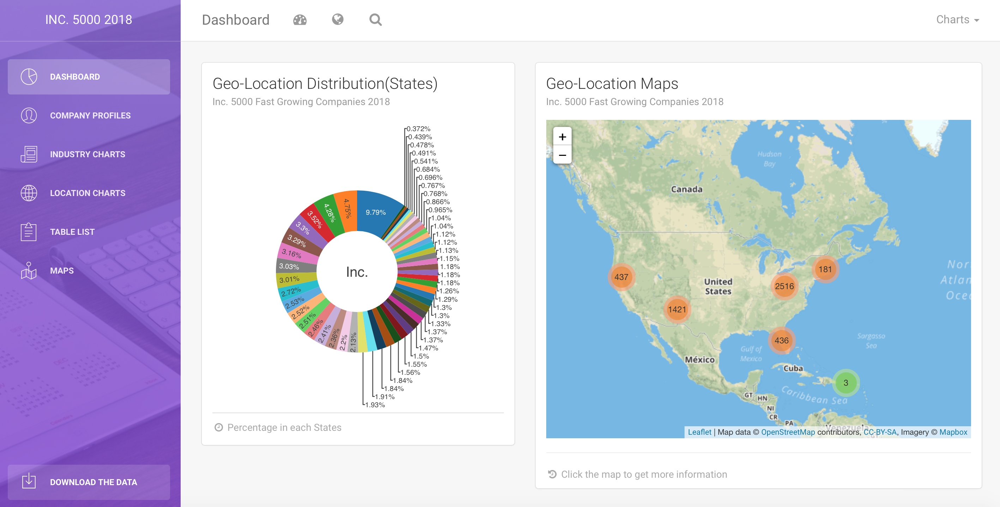
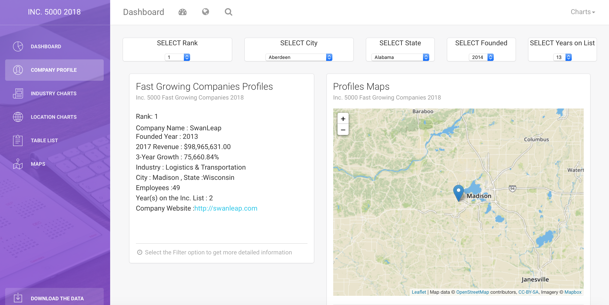
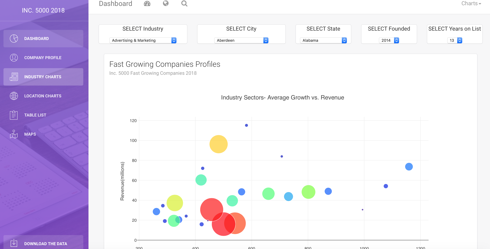
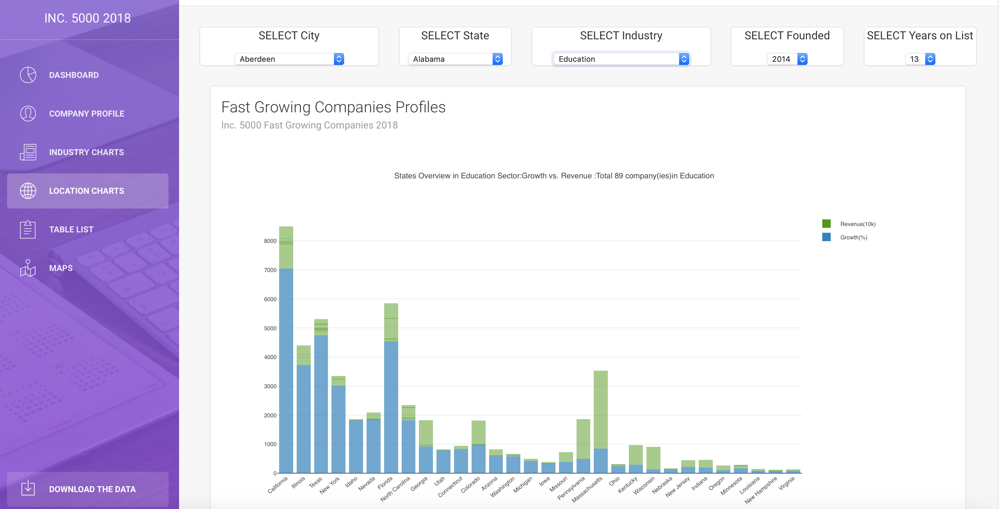
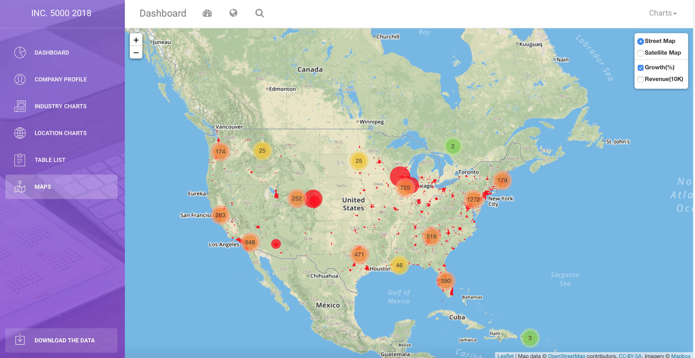

##   Data Journalism Project    
### [Data Visualization Website: https://inc5000-2018-dataviz-tj.herokuapp.com](https://inc5000-2018-dataviz-tj.herokuapp.com)

### Exploring INC Magazine's fastest growing private companies

#### Data Source

- [Inc. Magazine](https://www.inc.com) has published the fastest growing private companies ranking list every year. The full data sets are hosted in the data.world.     
  - [2018 Data](https://data.world/aurielle/inc-5000-2018) (Geo Data added in 2018 List)
  - [2007 - 2017 Data](https://data.world/aurielle/inc-5000-10-years)   
  
#### Project Overview
- Data Storage : PostgreSQL   
- Workflow Engine (WFE): Flask Web Server/SQLAchemy/Python   
- Web Application/GUI : HTML/CSS, JavaScript,D3,Leaflet.js   
- Production Deployment: Heroku  [(https://inc5000-2018-dataviz-tj.herokuapp.com)](https://inc5000-2018-dataviz-tj.herokuapp.com)
- Product : Web Data Journalism Visualization, JSON format API data for INC 5000 data      

#### 1. Data Extract and Load
- CSV formatted Data downloaded from the data.world
- Using python/SQLAchemy/psycopg2 to Extract out[(GitHub)](https://nbviewer.jupyter.org/github/Pyligent/Inc5000_Data_Viz_Project/blob/master/Data_Extract.ipynb)/Load into[(GitHub)](https://nbviewer.jupyter.org/github/Pyligent/Inc5000_Data_Viz_Project/blob/master/Data_Load.ipynb) the PostgreSQL database
- Flask Webserver will provide the JSON format API data

#### 2. Workflow Engine (WFE)
- Using the Flask Web server/SQLAchemy/Python  to create the API route and JSON data for data visualization
- Flask API JSON Data Route: [(app.py)](https://github.com/Pyligent/Inc5000_Data_Viz_Project/blob/master/app.py)
  - **@app.route("/2018metadata")**   
    Return Full Inc2018 5000 JSON Metadata   
  
  - **@app.route("/2018metadata/pages/<num>")**   
    Return Inc2018 5000 JSON Metadata by page, when num=0 return full data
  
   - **@app.route("/2018metadata/<filter_name>")**   
    Return filtered Inc2018 5000 JSON Metadata
    
   - **@app.route("/2018metadata/plot/<plot_name>")**   
    Return filtered Inc2018 5000 JSON Metadata for plotting
  
  - **@app.route("/rank/<ranking_number>")**   
    Return ranking query JSON data   
    
  - **@app.route("/state_s/<state_s>")**   
    Return State query JSON data   
    
  - **@app.route("/state_l/<state_l>/<page_num>")**
    Return State long name data by page
  
  - **@app.route("/city/< city>/<page_num>")**
    Return city data by page
    
  - **@app.route("/years_on/<yrs_on_list>")**   
    Return years on the list query JSON data
    
  - **@app.route("/years_on/<yrs_on_list>/<page_num>")**   
    Return years on the list query JSON data  by page  
  
    
  - **@app.route("/founded_year/< founded>")**   
    Return founded year query JSON data
    
    
  - **@app.route("/founded_year/< founded>/<page_num>")**   
    Return founded year query JSON data by page
  
    
  - **@app.route("/industry/< industry>/<page_num>")**
    Return industry data by page

  
  - **@app.route("/industry_growth_rev")**
    Return growth/revenue data groupby industry
    
  - **@app.route("/topten_cities")**
    Return top ten cities
    
  - **@app.route("/topten_companies")**
    Return the top ten companies
    
  - **@app.route("/growth_rev_state")**
    Return growth/revenue data groupby states
    
   

 - API JSON Data Format   
   
  
    
  
#### 3. Data Visualization 
 - Explore the Geo-location relation with the fastest growing private companies.
   - States views of the companies
   - City views of companies
   - Industry-related views of companies
   - Revenues-related views of companies
   - Distribution companies by different filters
 
 - Explore the individual company information
   - Visualization the company basic information
   - Headcount/Revenue/Years on the list/CEO
   - Website information
   
#### 4. Data Visualization Website and Dashborad
- Dashborad
  - Overview the whole dataset:Geo Information/Industry Information/Top Cities and Top companies
  - Full List
  
     
- Company Profiles
  - Choose the rank/city/state/founded year and years-on-list to get detailed information
  
     
- Industry Charts
  - Choose the industry sector/city/state/founded year and years-on-list to get industry-based growth and revenue information
  
  
- Location Charts
  - Choose the city/state/founded year and years-on-list to get loaction-based information
  
     
- Table List
  - Choose the industry/city/state/founded year and years-on-list to full raw data table by page
  
  
- Maps
  - Display all Geo information and related Growth and Revenue information
  

  
  
